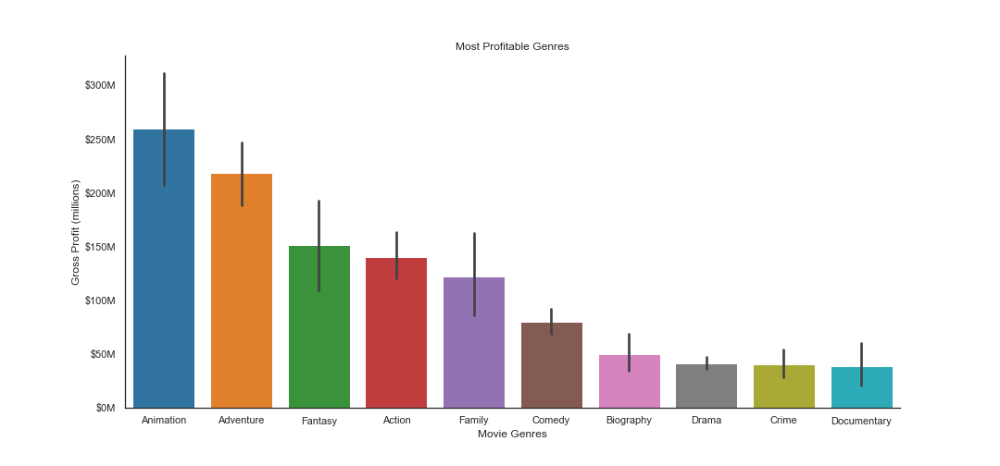
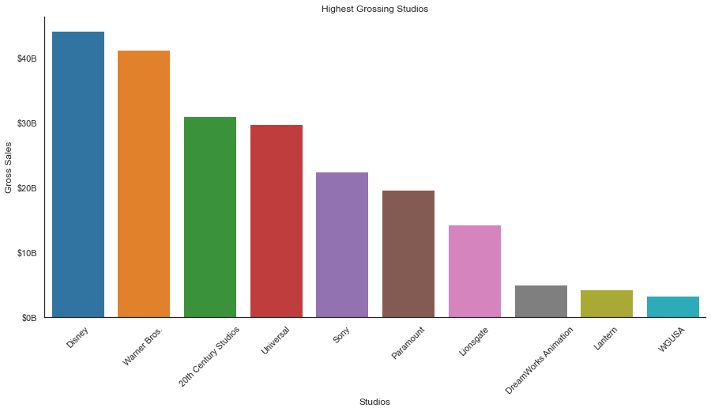
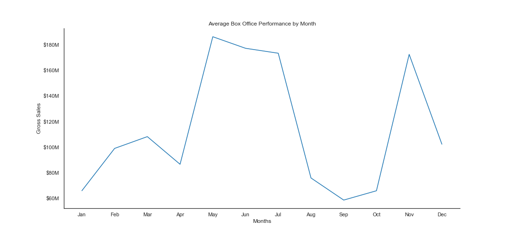

# Box Office Winners: An In-Depth Analysis of What It Takes to Make A Successful Movie

**Prepared for**: Microsoft<br />
**Authors**: [Alex Casey](mailto:alexcasey92@gmail.com)

## Overview

The motion picture industry is a multi-billion dollar business with movie success being largely uncertain, with “hits” and “flops” released almost every year. Analytics about the box-office performance of movies can give useful information to Microsoft so that they can make the most strategic decisions regarding production and financing. The analysis led to three key findings and recommendations for Microsoft:

1. Animated films still offer the largest risk/reward equation in the movie business
2. Acquiring or partnering with a studio could be a viable strategy for Microsoft as the industry continues to consolidate
3. When box office profits and generating the quickest return on investment are important, then the months of summer are the ideal time of the year for Microsoft to release a film


## Business Problem

Microsoft (the "Client") is interested in launching a new movie studio, but they don’t know anything about creating movies. In this report, we will explore what types of films are currently successful at the box office.

It's important to note upfront that while there's a lot of money to be made in the film industry, the economics of movie-making are far from simple. There's no sure path for a film to turn a profit since factors like brand awareness, P&A budgets, and the desires of a fickle public come into play. Theater attendance in the U.S. has been challenging over recent years, making it even more important to earn money in foreign theaters. Ever since Star Wars, merchandising has played a major role in revenue for films that appeal to children. Television rights, video-on-demand, and streaming services are increasingly important sources of income for movie studios.<sup>1</sup>

In this analysis, I will attempt to resolve three key questions for the Client in an effort to make a transition into movie-making successful:

* What types of movies have been produced the most in the past 20 years and what genres have been most successful?
* Which studios have been the most successful and do any warrant a potential partnership?
* Is release date a determinant of box-office success?

***

## Data

The data for this project comes from several large movie datasets including, Box Office Mojo (BOM), the Internet Movie Database (IMDB), Rotten Tomatoes, The MovieDB, and The Numbers. After investigating all sources, I settled on using datasets from BOM, IMDB, and The Numbers to form my hypotheses and develop three key recommendations. The data includes many different types of information about each movie, such as genre, domestic (USA) and foreign box office earnings, studio, and production budget. Furthermore, I define success in financial terms by using both worldwide gross sales and total profit, depending on the key question being answered. This analysis only covers data about the movies themselves.

***

## Methods

This project uses descriptive analysis. 

***

## Results

### Animation is the Most Profitable Movie Genre

In terms of genres, animation has the highest average profit, followed by adventure and fantasy. However, animation also has the largest variance in terms of gross profit as shown by the error bar, which suggests it could be a riskier genre to produce. 



### Disney and Warner Bros. Lead The Way at the Box Office




Walt Disney Studios ranks number 1 on this list of the top film production companies with total box office grossing exceeding US$40,000,000,000. The Walt Disney Studios division has several prominent film production companies, including, Walt Disney Pictures, Walt Disney Animation Studios, Pixar, Marvel Studios, Lucasfilm, 20th Century Studios and Searchlight Pictures.

<i>*The acquisition of 21st Century Fox by Disney was held from December 14, 2017 to March 20, 2019. Similar to other Disney film units, distribution of 20th Century films is now handled by Walt Disney Studios Motion Pictures, while 20th Century's sister company, Searchlight Pictures, operates their own autonomous distribution unit.[8] The first film released by Disney under the studio's new name was The Call of the Wild.</i>

### The Summer Box Office Phenomena Is Real




If studios are looking for pure ticket sales and the quickest return on their initial investment (budget), then the summer months present the best opportunity for a release. With children out of school and parents on vacation, this makes sense. 

November can also be a lucrative time for films, as studios gear up the the upcoming awards season.

## Recommendations

This analysis leads to three key recommendations:

1. Microsoft should invest in animated films, which offer the largest risk/reward equation in the movie business
2. Acquiring or partnering with a studio could be a viable strategy for Microsoft as the industry continues to consolidate
3. When box office profits and generating the quickest return on investment are important, then the months of summer are the ideal time of the year for Microsoft to release a film
***
<sup>1</sup>https://www.investopedia.com/articles/investing/093015/how-exactly-do-movies-make-money.asp
## For More Information

Please review my full analysis in [my Jupyter Notebook](./Technical Notebook.ipynb) or our [presentation](./DS_Project_Presentation.pdf).

For any additional questions, please contact **Alex Casey & alexcasey92@gmail.com**

## Repository Structure

Describe the structure of your repository and its contents, for example:

```
├── README.md                           <- The top-level README for reviewers of this project
├── Technical Notebook.ipynb            <- Narrative documentation of analysis in Jupyter notebook
├── DS_Project_Presentation.pdf         <- PDF version of project presentation
├── data                                <- Both sourced externally and generated from code
└── images                              <- Both sourced externally and generated from code
```
